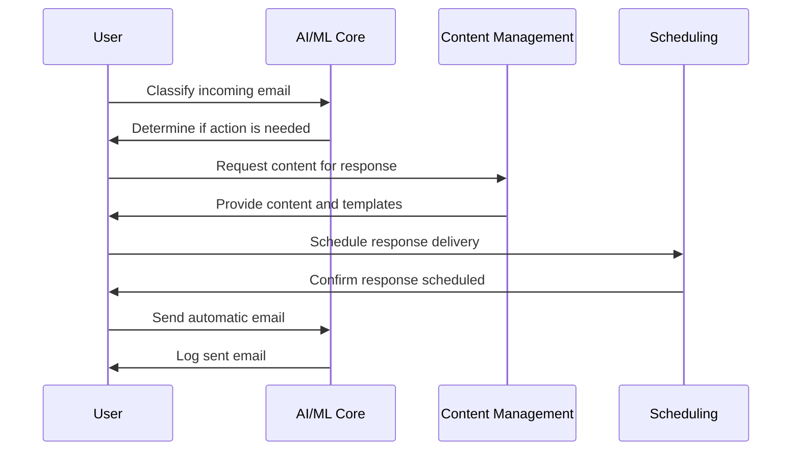
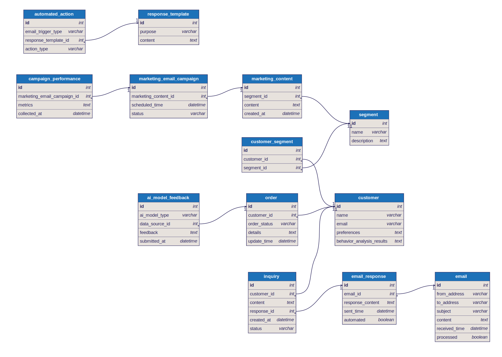
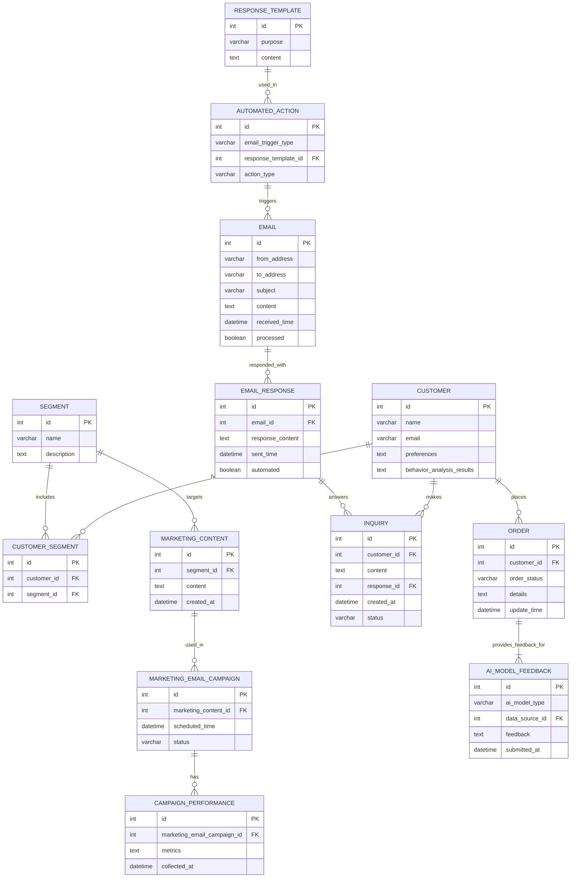

# GPT-Respond-Box

GPT-Respond-Box is an automated AI mailbox for businesses that can read, understand, and respond to emails. It is designed to help automate customer support, sales, and marketing tasks, as well as perform pre-setup tasks on behalf of the user.

## Project Capabilities
GPT-Respond-Box offers the following capabilities:

- **Automation of email processing** - The GPT-Respond-Box aids in automatically reading, understanding, and taking necessary actions in response to incoming emails, effectively replacing the need for manual sorting and replying, enhancing productivity.
- **Customer support automation** - Equipped to handle customer inquiries, support tickets, and feedback through automated responses, the GPT-Respond-Box offers timely and relevant assistance, improving customer satisfaction and support quality.
- **Sales and marketing automation** - This tool automates the creation and sending of personalized marketing emails, lead qualification, and follow-up processes to optimize sales operations and magnify marketing efforts.
- **Pre-setup tasks automation** - By automating routine tasks such as scheduling emails, managing follow-ups, and organizing communications, the GPT-Respond-Box enables users to focus on more strategic activities.

## Project Modules
GPT-Respond-Box is composed of the following modules:

- **Order Management** - The Order Management module monitors and processes customer orders, updates their statuses, and sends notifications, ensuring an efficient order-processing pipeline.
- **AI/ML Core** - This module is the intelligence center, using AI and ML to interpret email content, learn from interactions, and enhance its ability to provide accurate and context-aware responses.
- **Networking & Communication** - It establishes and manages connections with email servers, ensuring secure and reliable communication for the swift exchange of emails.
- **Scheduling** - With the Scheduling module, GPT-Respond-Box can plan and execute automated email tasks, such as sending out marketing campaigns at peak times for optimal engagement.
- **Notification** - The Notification module alerts users about critical tasks, such as high-priority emails or follow-ups, maintaining user engagement and response timeliness.
- **Analytics and Reporting** - This module provides insights into email campaign performance, user interactions, and system effectiveness, helping users make informed decisions based on accurate data.
- **Content Management** - By managing a repository of response templates and marketing content, this module ensures that the GPT-Respond-Box conveys consistent and relevant information to customers.

## Detailed User Stories
GPT-Respond-Box is composed of the following user stories:

### 

    
Story 4: As a user, I want to set up automatic email responses for certain tasks I manually predefine, such as sending invoices or booking confirmations.

- **Goal:** Automate pre-setup tasks based on email interactions
- **Modules:** AI/ML Core, Scheduling, Content Management

#### Workflow
1. Identify and classify incoming emails based on content and intent using the AI/ML Core module.
2. Based on predefined user settings, determine if the incoming email requires an automated action such as sending an invoice or booking confirmation.
3. Fetch required content (like invoice details or booking information) from the Content Management module.
4. Prepare an appropriate email response using Content Management module templates.
5. Schedule the prepared response for immediate or delayed delivery using the Scheduling module.
6. Send the response automatically to the sender.
7. Log the event and the response in the system for user's future review and potential analysis.

#### Sequence Diagram

    
#### Milestones

#### Email Classification
- Develop functionality to parse incoming emails into a structured format for further processing.

- Implement AI algorithms to recognize the intent and content of parsed emails.

#### Automated Action Determination
- Create a rules engine to map recognized email intents to predefined user settings for automated actions.

#### Content Fetching
- Design mechanisms to retrieve specific content, such as invoices or booking details, required for the email response.

#### Response Preparation
- Develop the functionality to apply retrieved content to email templates to form proper email bodies.

#### Email Scheduling and Sending
- Incorporate scheduling options to send emails immediately or at a pre-defined time.

- Implement the process to automatically send out the scheduled emails.

#### Logging and Review
- Ensure that every email sent is logged within the system along with its details for review.

        

  
## Project Models
GPT-Respond-Box is composed of the following models:

- **customer** - The customer model holds personal data, preferences, and analysis of a customer's behavior, which is integral for providing personalized communication and improving customer experiences.
- **segment** - This model allows the system to classify customers into segments based on defined criteria, enabling targeted marketing strategies.
- **marketing_content** - Marketing content associated with customer segments is maintained in this model, aiding in delivering tailored content that is likely to resonate with each customer group.
- **marketing_email_campaign** - This model manages the lifecycle of email campaigns, from scheduling to tracking the status, ensuring systematic and organized execution of marketing initiatives.
- **response_template** - Pre-defined response templates categorized by purpose are stored here. These templates enable rapid and consistent replies to common inquiries or triggers.
- **automated_action** - Actions triggered by conditions outlined in received emails are defined within this model, driving the automation of responses or tasks in correspondence with email content.
- **order** - The order model tracks the progress and status of customer orders, playing a crucial role in the automated management and communication of order-related updates.
- **email** - This model captures incoming and outgoing email details, ensuring an organized archive of communication that can be processed and referred to by the system.
- **email_response** - Email responses, whether automated by the system or manually crafted, are tracked in this model, including the content and when it was sent.
- **inquiry** - Capturing customer inquiries and their status updates, this model aids in monitoring the responsiveness and handling of customer interactions.
- **campaign_performance** - Metrics and performance data of marketing email campaigns are accumulated here for post-campaign analysis and improvement.
- **ai_model_feedback** - This model collects feedback on AI model performance to continuously improve its understanding and functioning based on real-world use cases.

  
## Entity-Relationship Schema Diagram

## Entity-Relationship Diagram

